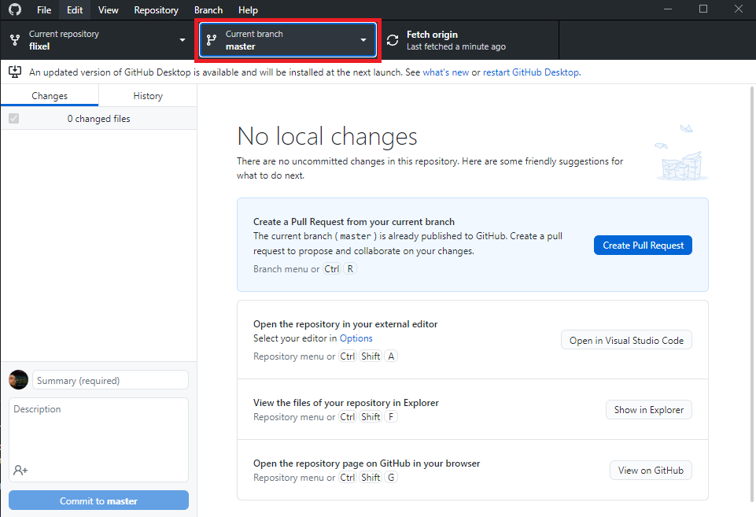
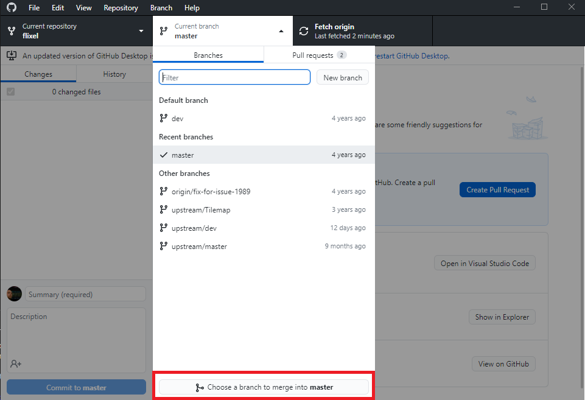
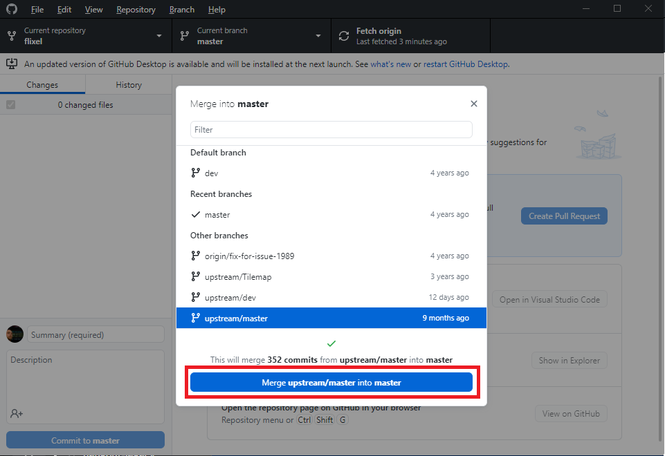
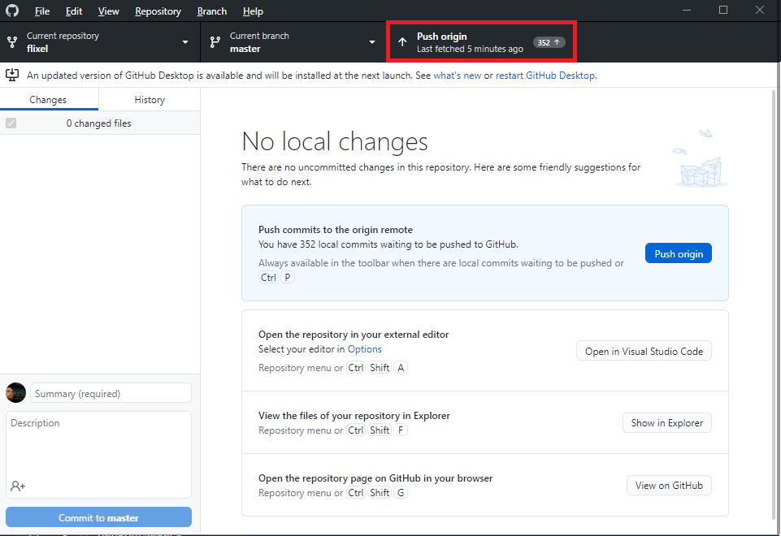
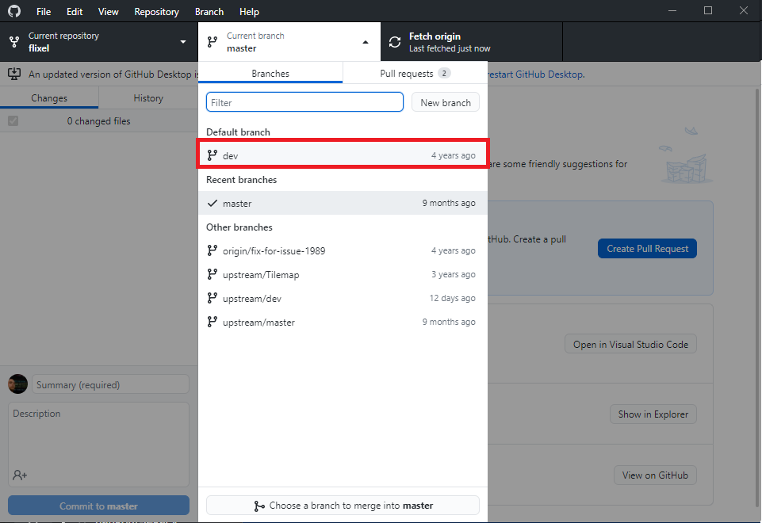
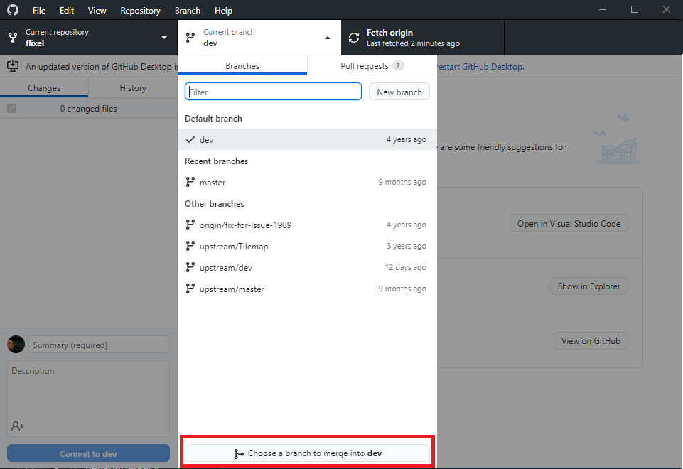
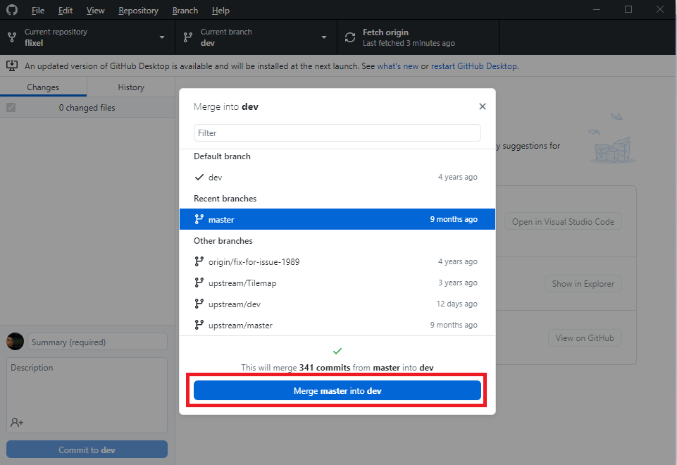

# Git Fork Syncing
This document's purpose is to provide a step-by-step guide for keeping a forked project in sync with the original repository it was based off of. When doing work on a feature branch, it isn't uncommon for the branch your feature was based off of (usually `main` or `master`) to get an updated. After the base branch updates, you have a couple of pieces of work to take care of:
 - update your "local" `main` branch to match the "upstream" original repository's `main` branch.
 - push your "local" `main` branch to your forked repository to make "origin" match "upstream".
 - pull `main` into your feature branch and resolve any merge conflicts.

The series of pictures included below show how to do this using the GitHub Desktop GUI client:
1. Check out your local `main` branch.

2. Click the button at the bottom of the branch drop down menu to merge an external branch into local `main`.

3. Merge `upstream/main` into local `main`, this applies all updates that have happened to the original repository.

4. Push local `main` to the `origin` remote (should be the default setting that happens when you push)

5. Checkout your local feature branch that needs to be updated.

6. Click the button at the bottom of the branch drop down menu to merge an external branch into your local feature branch.

7. Merge your local `main` branch into your feature branch to apply all updates (this might cause merge conflicts, now's your chance to resolve them!)

After all of this is taken care of, you can push your feature branch as normal, and your feature branch should be properly up-to-date with all changes that were merged to the original repository!